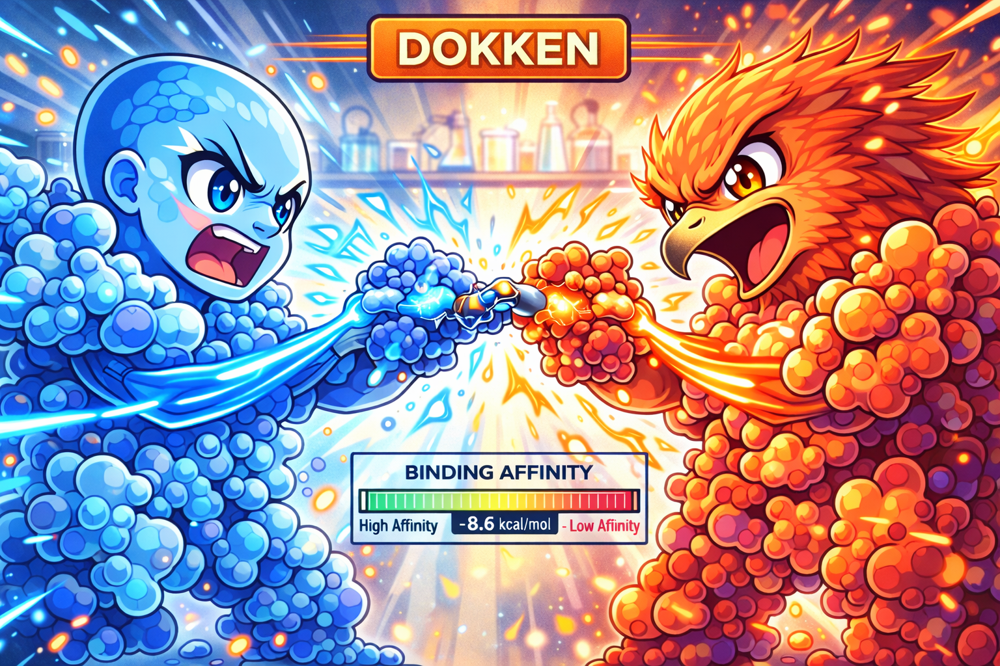

Dokken is a computational surveillance project intended for use in risk assessment of viral host-switching events before they happen.

It is a guided molecular docking pipeline with automated bounding box generation and ranked pose filtering powered by trained convolutional neural network.

Background Previous studies have shown that bird-adapted influenza viruses adapt to human hosts by acquiring mutations in hemagglutinin (HA) that increase binding to human-type sialic acid receptors (α2,6-linked) in preference to the avian-type receptors (α2,3-linked). In practical terms, mutations that strengthen binding to the human receptor make transmission more likely.

This project takes advantage of recent advances in protein structure prediction using OpenFold3 (OF3). From OF3 predicted structures, the receptor binding site is refined, side-chain conformations are optimized (Rosetta) and flexible docking is performed (Vina/Smina). Docked poses are ranked and filtered using neural network–based scoring models.

The pipeline is built to run at high throughput. A graph neural network trained on known crystal structures bound to sialylated glycans predicts the binding interface in each OF3-generated structure.

That predicted interface (the prior) is then used to automate definition of the docking region (bounding box), identify which residues need side-chain optimization for Rosetta-based energy minimization, select which residues will be set to flexible for sidechain docking.

These steps usually require manual intervention in most docking workflows thereby hindering high throughput predictions. Automating these steps removes a major bottleneck. Several "sanity checks" are output as visualizations that can be used to quickly assess whether the docking result achieved is rational.

The approach is simple and modular and can be adapted to other receptor–ligand systems, including antibody–antigen interactions. Please do!
Pipeline Workflow

It is a guided molecular docking pipeline with automated bounding box generation and ranked pose filtering powered by trained convolutional neural network.

Background Previous studies have shown that bird-adapted influenza viruses adapt to human hosts by acquiring mutations in hemagglutinin (HA) that increase binding to human-type sialic acid receptors (α2,6-linked) in preference to the avian-type receptors (α2,3-linked). In practical terms, mutations that strengthen binding to the human receptor make transmission more likely.

This project takes advantage of recent advances in protein structure prediction using OpenFold3 (OF3). From OF3 predicted structures, the receptor binding site is refined, side-chain conformations are optimized (Rosetta) and flexible docking is performed (Vina/Smina). Docked poses are ranked and filtered using neural network–based scoring models.

The pipeline is built to run at high throughput. A graph neural network trained on known crystal structures bound to sialylated glycans predicts the binding interface in each OF3-generated structure.

That predicted interface (the prior) is then used to automate definition of the docking region (bounding box), identify which residues need side-chain optimization for Rosetta-based energy minimization, select which residues will be set to flexible for sidechain docking.

These steps usually require manual intervention in most docking workflows thereby hindering high throughput predictions. Automating these steps removes a major bottleneck. Several "sanity checks" are output as visualizations that can be used to quickly assess whether the docking result achieved is rational.

The approach is simple and modular and can be adapted to other receptor–ligand systems, including antibody–antigen interactions. Please do!
Pipeline Workflow
